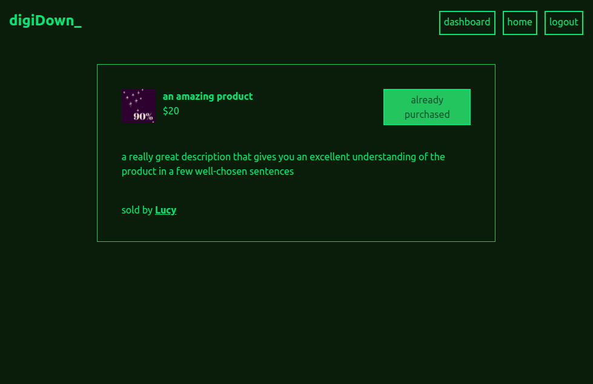

# digiDown - digital file sharing site

From a [tutorial](https://github.com/flaviocopes/bootcamp-2022-week-13-digital-downloads) by [Flavio Copes](https://github.com/flaviocopes)

Built in NextJS with Prisma, PostgreSQL database hosted on [Railway.app](https://railway.app/), payments handled by [Stripe.com](https://stripe.com), image and document hosting on [AWS S3](https://aws.amazon.com).

-   homepage listing of all available products
-   log in with Next-Auth to buy and sell
-   upload digital files, add a picture and set your own price
-   pay for products online via Stripe
-   user dashboard displays products listed and purchased

Note: I built this as a tutorial to learn how to set up Stripe payments; the app is not hosted online to prevent users accidentally making payments. You can see it in action in this short video:

[digiDown](<../../Videos/digiDownVid%20(copy).webm.mov>)

